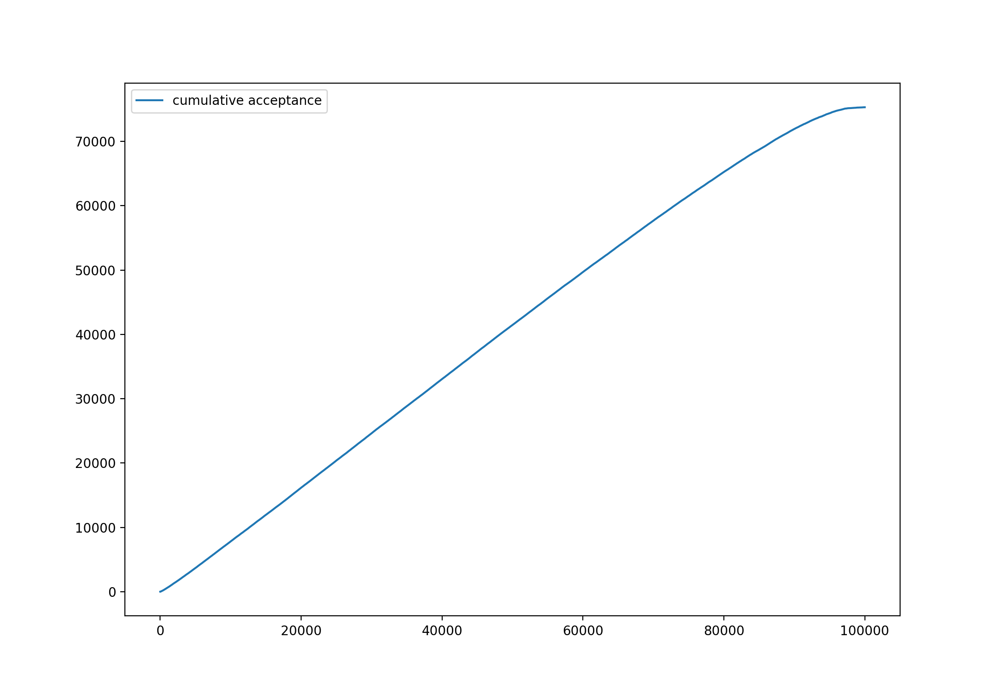
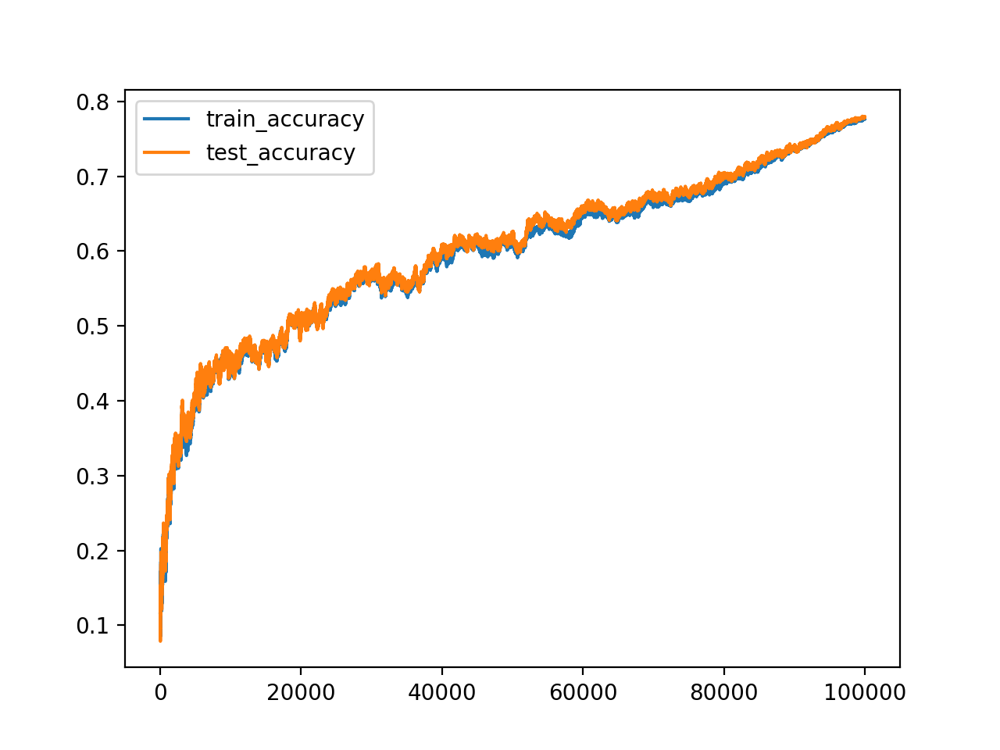

### Get Started
Download the repository
```
git clone https://github.com/XingyuHe/simulated_annealing_neural_network
```
Get to the working directory
```
cd simulated_annealing_neural_network
```
Install libraries
```
pip install -r requirements.txt
```
Download MNIST dataset into the directory
```
curl https://storage.googleapis.com/tensorflow/tf-keras-datasets/mnist.npz --output ./mnist.npz
```

### Result
The neural network architecture used here is 
`[784, 128, 10]`.
A state is a specific configuration of the weights in the neural network. 
Our energy function is 
`tf.keras.losses.SparseCategoricalCrossentropy`.
A proposal state is generated from a 
random uniform distribution between -1 and 1. The
temperature is linearly decreasing. 
100,000 iterations of annealing were run.

Interestingly, the energy function increases
rapidly first and gradually decreasing, which 
can be attributed to the high tendency of 
exploration early on.  


The rate at which a proposal is accepted roughly 
constant. The overall acceptance is 70%. 


The accuracy of the neural network is improving
on both training set and test set.


However, I trained the same neural network using
propagation and gradient descent and reached 
almost 100% accuracy on training set and 97% 
accuracy on testing set in a tenth of the 
iterations on simulated annealing. Alternative, 
I used backpropagation to produce gradients and 
guide the proposal process. The alternative 
training method performs the same than 
just gradient descent. 

